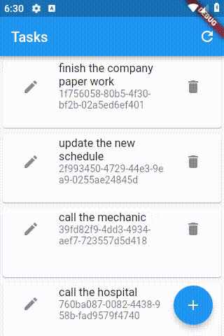

# e013_flutter_slivergrid_e004base

## Based On e004

- [elrashid-flutter-examples/e004_flutter_listview_crud_app_using_nonsecure_rest_api](https://github.com/elrashid-flutter-examples/e004_flutter_listview_crud_app_using_nonsecure_rest_api)

## Screen Record

## What

- SliverGrid for tasks in flutter Task app (e004)

- From [SliverGrid class - widgets library - Dart API](https://api.flutter.dev/flutter/widgets/SliverGrid-class.html)

----
  > A sliver that places multiple box children in a two dimensional arrangement.
----
  > SliverGrid places its children in arbitrary positions determined by gridDelegate. Each child is forced to have the size specified by the gridDelegate.
----
  > The main axis direction of a grid is the direction in which it scrolls; the cross axis direction is the orthogonal direction.
----

- must run with :

  - [elrashid-flutter-examples/e002-aspcore-rest-api-server-for-flutter](https://github.com/elrashid-flutter-examples/e002-aspcore-rest-api-server-for-flutter)

## Slivers

- Slivers (based on [Slivers - Flutter](https://flutter.dev/docs/development/ui/advanced/slivers))
  
  > A sliver is a portion of a scrollable area. You can use slivers to achieve custom scrolling effects.

- [flutter - Is there any definite list of Sliver widgets   Stack Overflow](https://stackoverflow.com/questions/44493372/is-there-any-definite-list-of-sliver-widgets)

 
## Full code

    return CustomScrollView(
        slivers: <Widget>[
        SliverGrid(
            gridDelegate: SliverGridDelegateWithFixedCrossAxisCount(
            crossAxisCount: 1,
            childAspectRatio: 3,
            ),
            delegate: SliverChildBuilderDelegate(
                (BuildContext context, int index) {
            return TaskWidget(
                taskOpj: tasks[index],
                notifyParent: refresh,
            );
            }, childCount: tasks.length),
        ),
        ],
    );

## Ref

[Sliverlist - Google Search](https://www.google.com/search?q=Sliverlist&oq=Sliverlist&aqs=chrome..69i57j0l5.11288j0j7&sourceid=chrome&ie=UTF-8)

[Making Dynamic Layouts with Slivers in Dart's Flutter Framework - YouTube](https://www.youtube.com/watch?v=wN2lpqxkB4M)

[Flutter_Sliver_Tutorial/main.dart at master · tensor-programming/Flutter_Sliver_Tutorial](https://github.com/tensor-programming/Flutter_Sliver_Tutorial/blob/master/lib/main.dart)

[SliverAppBar (Flutter Widget of the Week) - YouTube](https://www.youtube.com/watch?v=R9C5KMJKluE)
 

[SliverGeometry is not valid: The "scrollExtent" is negativ - Google Search](https://www.google.com/search?ei=TpFAXaqYBtLjgweCkrywDA&q=SliverGeometry+is+not+valid%3A+The+%22scrollExtent%22+is+negativ&oq=SliverGeometry+is+not+valid%3A+The+%22scrollExtent%22+is+negativ&gs_l=psy-ab.3..35i302i39.127700.127700..127975...0.0..0.195.195.0j1......0....2j1..gws-wiz.Bw5UxG3B32A&ved=0ahUKEwiq97fJp93jAhXS8eAKHQIJD8YQ4dUDCAo&uact=5)

[Search · scrollExtent](https://github.com/search?l=Dart&q=scrollExtent&type=Code)

[SliverGrid - Google Search](https://www.google.com/search?q=SliverGrid&oq=SliverGrid&aqs=chrome..69i57j0l5.278j0j7&sourceid=chrome&ie=UTF-8)

[SliverList & SliverGrid (Flutter Widget of the Week) - YouTube](https://www.youtube.com/watch?v=ORiTTaVY6mM)

[SliverFixedExtentList - Google Search](https://www.google.com/search?ei=M6hAXfylOt6EhbIPj6muqAs&q=SliverFixedExtentList&oq=SliverFixedExtentList&gs_l=psy-ab.3..35i39j0l3.9481.9481..9806...0.0..0.304.304.3-1......0....2j1..gws-wiz.......0i71.KE_Ory87ELU&ved=0ahUKEwi8i8u0vd3jAhVeQkEAHY-UC7UQ4dUDCAo&uact=5)

[SliverFixedExtentList class - widgets library - Dart API](https://api.flutter.dev/flutter/widgets/SliverFixedExtentList-class.html)

[Slivers, Demystified - Flutter - Medium](https://medium.com/flutter/slivers-demystified-6ff68ab0296f)